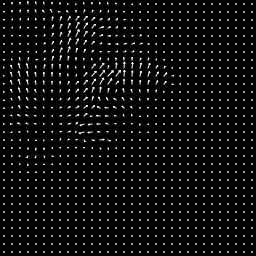

# 最简单的流体仿真


## 背景简介
仿真部分还是要交作业的

第二节流体仿真课之后,天添老师提到了The Art of Fluid Animation [Stam 2015]及其中译本《流体动画的计算艺术》-- 叶军涛、杨旭波译这一科普向的读物。刚好校图书馆里有，我便拿来翻了翻。的确大部分都十分可理解，可是在其通俗诙谐的文字中还是包含了许多硬核的知识，可无奈作者都跳过了。而在其中一部分给出了一个流体仿真器的主体部分C实现,看上去比较友好，于是便有了这次作业。

其实书中关于这个流体仿真器的实现是作者总结了自己在[GDC2003上的Real-Time Fluid Dynamics for Games](https://www.autodesk.com/research/publications/real-time-fluid-dynamics)与发布的[A Simple Fluid Solver based on the FFT(Journal of Graphics Tools 2001)](https://www.autodesk.com/research/publications/a-simple-fluid-solver)这篇。

## 成功效果展示




## 整体结构
```
-LICENSE
-|output
-README.MD
-main.py                    主程序
-bruteforce_fluid_solver.py 半拉格朗日法流体仿真
-fft_fluid_solver.py        用FFT写了project部分
-taichi_logo_list.py        用List存了Taichi的Logo
```
## 使用方法
单击添加流速,右击添加染料

v键切换画布与速度场视图

s键截图,r键录制

t键添加Taichi的Logo

## 还存在的问题
FFT部分由于python本身的效率低下及我对numpy和taichi结合不良,而我自己又不太会写并行FFT,所以基本不能运行,甚至完全不能调试(假装我写对了吧)

GUI中对于鼠标点击拖动的采样率太低,所以笔迹完全不连续

我也不太清楚如何用ti.VideoManager录制直接绘制屏幕上的符号

## 运行方式
我直接  `python3 main.py`
